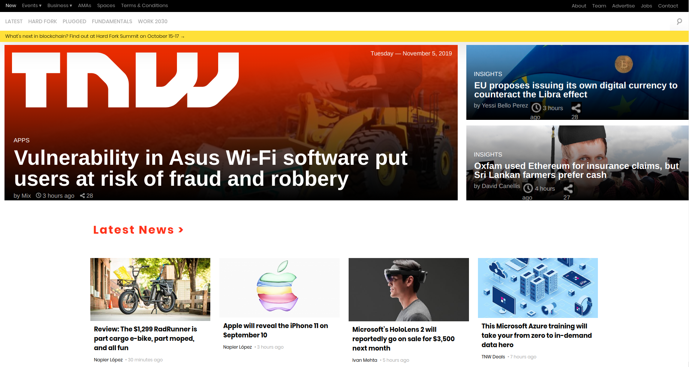
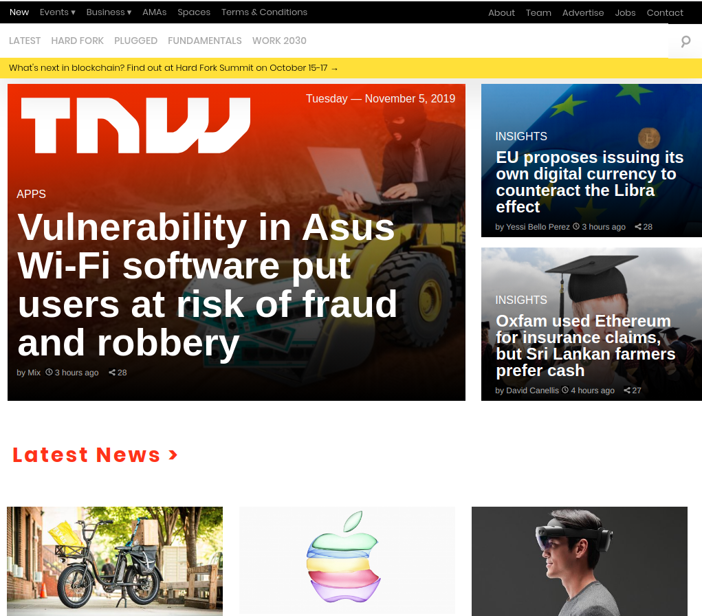

<!--
*** Thanks for checking out this README Template. 
-->

<!-- PROJECT TITLE -->

 
<h1 align="center">Building with Responsive Design</h1>

    clone the The Next Web 
     

<!-- TABLE OF CONTENTS -->

## Table of Contents

* [About the Project](#about-the-project)
  * [Built With](#built-with)
* [Getting Started](#getting-started)
* [License](#license)
* [Contact](#contact)
* [Acknowledgements](#acknowledgements)

<!-- ABOUT THE PROJECT -->
## About The Project

### This project consists of replicating the The Next Web website putting emphasis on how it behaves differently depending on the size of the screen where the website is rendered.

  
## Desktop size

  
## Tablet size

  
## Mobile size

 

### Built With 

* HTML 
* CSS3 
* Github

<!-- GETTING STARTED -->
## Getting Started

Just clone or download the project and open the index.html in your browser. 

<!-- LICENSE -->
## License

Distributed under the MIT License. See `LICENSE` for more information.

<!-- CONTACT -->
## Contact
* Felipe Enne - felipeenne@gmail.com  
* Ricardo Valtierra - ricardo_valtierra@outlook.com

<!-- ACKNOWLEDGEMENTS -->
## Acknowledgements

* Microverse.